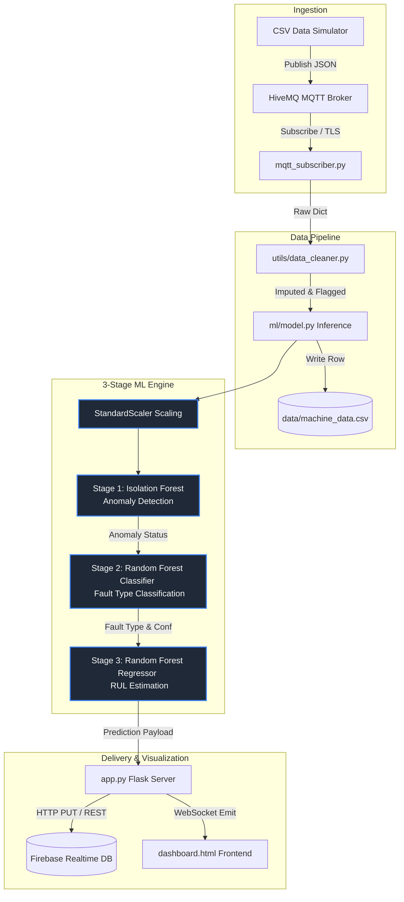

# Nirikshak — IoT-Based Predictive Maintenance Platform
## System Specification, Architecture, and Machine Learning Report

This report documents the software architecture, technical specifications, preprocessing pipeline, machine learning models, and system workflow for **Nirikshak**, an advanced IoT-based predictive maintenance platform designed to monitor industrial machines.

---

## 1. System Overview & Software Specification

Nirikshak ingests high-frequency machine telemetry (Temperature, Vibration, Current, Voltage, RPM) via MQTT/CSV, processes the data in real-time, runs a sequential three-stage Machine Learning (ML) inference pipeline, and visualizes the results on a high-fidelity glassmorphic web dashboard powered by Flask and Socket.IO.

### Technical Stack & Dependencies
*   **Operating System**: Agnostic (Windows / Linux / macOS)
*   **Programming Language**: Python 3.10+
*   **Backend Web Framework**: Flask 3.0.x with Eventlet (asynchronous concurrency)
*   **Real-time Communication**: Flask-SocketIO (WebSocket protocol)
*   **Machine Learning Engines**: Scikit-Learn (v1.3+), Joblib
*   **Data Manipulation**: Pandas, NumPy
*   **Message Broker**: MQTT (HiveMQ Cloud broker using TLS/SSL)
*   **Database Integration**: Firebase Realtime Database (HTTPS REST / Firebase SDK)
*   **Frontend Visualization**: HTML5, Vanilla CSS (Glassmorphism design tokens), Chart.js (v4.4), Socket.IO client library

---

## 2. System Architecture

The following architecture diagram displays the flow of data from ingestion to preprocessing, three-stage ML inference, and final delivery to the frontend dashboard and Firebase.



---

## 3. Data Preprocessing Pipeline

To prepare high-frequency machine telemetry for inference, the system passes raw readings through a robust preprocessing pipeline defined in `_extract_and_clean_sensors` within `ml/model.py`:

1.  **Extraction & Alias Resolution**: Reads dictionary values and resolves common name variations (e.g., mapping `temp`, `Temperature(C)`, or `temperature` to a single key).
2.  **Imputation of Missing Values**: Uses precalculated feature medians (`medians.pkl`) to replace missing or corrupt sensor values, ensuring the pipeline never fails on empty payloads.
3.  **Outlier Flagging (Flag-Not-Drop)**: Evaluates clean values against critical thresholds to detect sensor outliers immediately without dropping rows:
    *   **Temperature**: $> 85.0^\circ\text{C}$
    *   **Voltage**: Deviation from nominal $230.0\text{ V}$ ($|V - 230| > 0.5\text{ V}$)
    *   **Vibration**: $> 4.0\text{ g}$
    *   **Current**: $> 10.0\text{ A}$
    *   **RPM / Proximity**: $> 1450.0\text{ rpm}$
4.  **Standardization**: Fits standard values into a standard normal distribution (mean=0, variance=1) using a pre-trained `StandardScaler` (`scaler.pkl`), matching the training scale of the downstream ML models.

---

## 4. The 3-Stage Machine Learning Engine

The system uses a sequential, multi-model approach to balance detection speed, explanation depth, and forecasting accuracy.

| Inference Stage | Model Used | Outputs | Rationale & Selection Criteria |
| :--- | :--- | :--- | :--- |
| **Stage 1: Anomaly Detection** | **Isolation Forest** | Anomaly Status (Normal/Anomaly) & Score | **Unsupervised Detection**: Learns healthy machine operation footprints. It isolates outliers in high-dimensional feature space without needing balanced labels, flags unexpected sensor behavior instantly, and scales efficiently. |
| **Stage 2: Fault Classification** | **Random Forest Classifier** | Fault Type (e.g., Bearing, Electrical, Overheating) & Confidence % | **Ensemble Accuracy**: Combines decision trees to handle highly non-linear feature interactions (such as current causing heating, and voltage scaling with RPM). It is robust against overfitting, fast, and generates well-calibrated confidence scores. |
| **Stage 3: RUL Estimation** | **Random Forest Regressor** | Predicted Remaining Useful Life (RUL) in Hours | **Multi-Variate Non-Linear Regression**: Maps the machine's current operating hours and scaled sensor values to a remaining lifespan. Captures wear patterns (e.g., how high vibration accelerates lifespan decay) with stable numerical regression outputs. |

---

## 5. Software Implementation Detail

*   `config.py`: Serves as the central repository for credentials, port assignments, and threshold limits.
*   `ml/model.py`: Contains the lazy-loading loaders for all pickle models (`.pkl`), the preprocessing logic, the rule-based fallback system (ensuring high system availability if models fail to load), and the main `predict()` entry point.
*   `mqtt_subscriber.py`: Runs a background listener that receives live telemetry over MQTT. It handles connection retries, parses JSON packets, runs them through the pipeline, writes to the log database (`data/machine_data.csv`), and forwards the output.
*   `app.py`: The Flask server running an eventlet loop. It exposes endpoints like `/api/history` to load past csv logs, and broadcasts incoming readings to all connected web clients in real-time.
*   `templates/dashboard.html`: The visual cockpit of the system, implementing:
    *   **Glassmorphic Design System**: Vibrant background radial glows, cards with translucent border overlays, backdrop blurs, and micro-animations.
    *   **3D Centerpiece Visual**: A floating 3D motor render.
    *   **Interactive Modal System**: Detailed overlays displaying historical sparklines, interval stats (mean, peak, min), and limits for all 8 parameters.

---

## 6. Operation Workflow

```
[Live Telemetry] ➔ [MQTT Broker] ➔ [Subscriber Module] ➔ [Model Preprocessing]
                                                                  │
                                                        [Standardization]
                                                                  │
                                                        ┌─────────┴─────────┐
                                                        ▼                   ▼
                                                [Rule-based Flags]   [3-Stage ML Engine]
                                                        │                   │
                                                        └─────────┬─────────┘
                                                                  ▼
[Web Dashboard] ◄────── [Socket.IO Broadcast] ◄────── [Combined JSON Output] ➔ [Firebase Database]
```

1.  **Ingestion**: Sensors publish physical parameters to HiveMQ Cloud.
2.  **Subscriber Processing**: `mqtt_subscriber.py` intercepts the payload and passes it to the `predict()` module.
3.  **Inference**: The 3-Stage ML Pipeline cleans data, calculates cumulative operating hours, isolates anomalies, classifies the specific fault type, and projects remaining useful hours.
4.  **Local Logging**: The enriched record is saved to `data/machine_data.csv`.
5.  **Cloud Publishing & Broadcast**: The system pushes the payload to Firebase and emits a real-time event to `app.py`, which immediately updates the dashboard UI.
